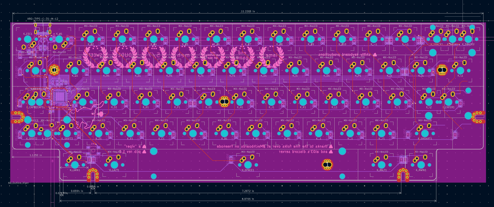
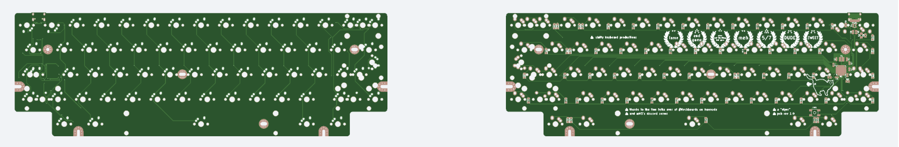
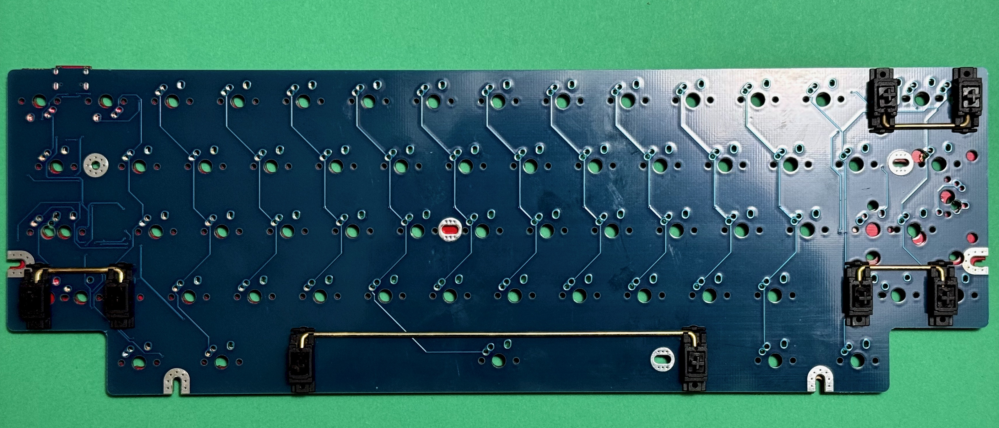

# Duck Viper v1 PCB

This repository contains KiCad files for an attempt at the Duck Viper v1 PCB design.

Work In Progress

## Files Included
- KiCad project files
- Schematic
- PCB layout

## Usage
Open the project in KiCad to view and modify the design.

## Revision 1 (Failed)

## License
MIT License