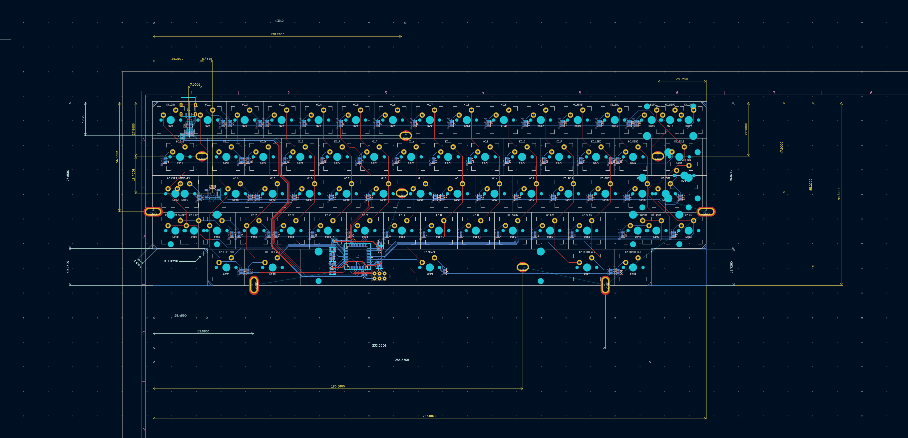
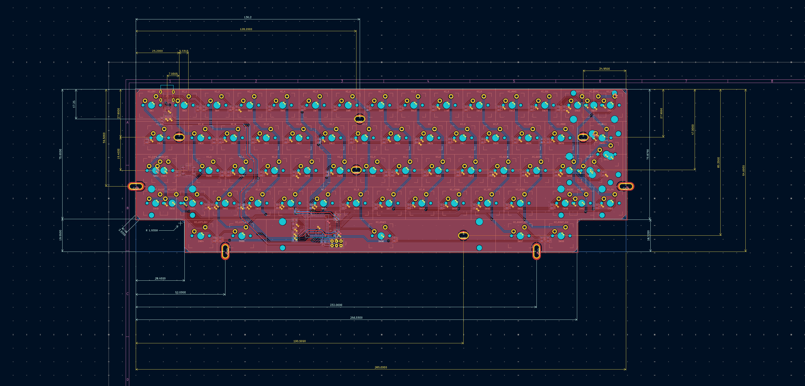
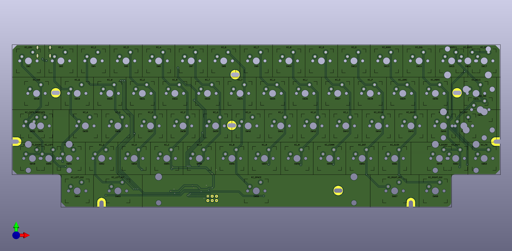
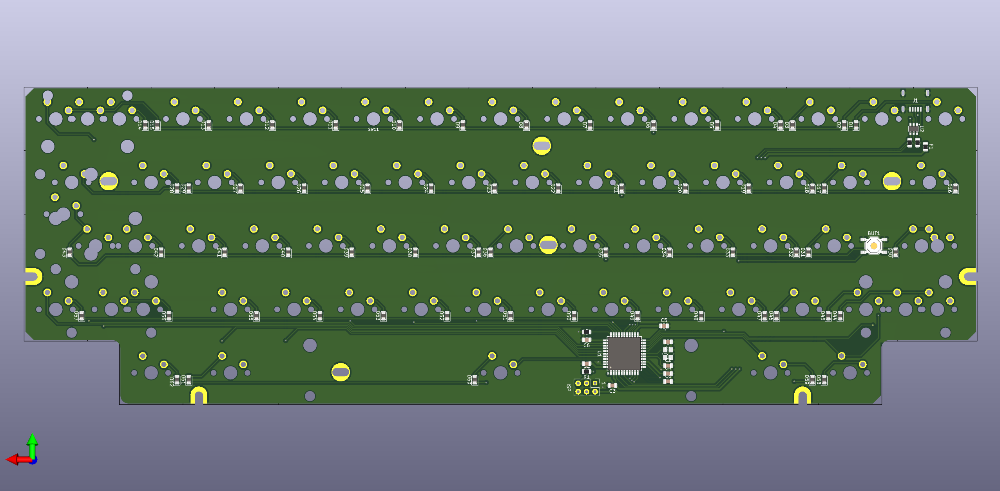

# Duck Viper v1 PCB

This repository contains KiCad files for an attempt at the Duck Viper v1 PCB design.

- Work In Progress
- Optional Split Shifts, Split Backspace, Stepped Caps Lock & ISO Enter
- No LEDs
- With 5 rows and 14 columns, there is only 1 pin left on the Atmega

## Files Included
- KiCad project files
- Schematic
- PCB layout

## Usage
Open the project in KiCad to view and modify the design.

## Revision 5.2025

## Thanks yo
- https://github.com/ruiqimao/keyboard-pcb-guide
- https://wiki.ai03.com/books/pcb-design
- https://github.com/evyd13/plain60-b
- https://github.com/evyd13/plain60-c
- https://www.masterzen.fr/2020/05/03/designing-a-keyboard-part-1/
- https://imgur.com/LQXco3J

## Todo
- Leds?
- https://github.com/adamws/keyboard-tools
- https://keyboard-tools.xyz

## Notes
- Is the reset switch position correct?
- [Japanese duplex matrix](https://kbd.news/The-Japanese-duplex-matrix-1391.html)
- [Pulldown resistor on KMAC Happy](https://geekhack.org/index.php?topic=87703.msg2485259#msg2485259)
- [Nexperia 74HC237 3-to-8 line decoder, demultiplexer with address latches](https://assets.nexperia.com/documents/data-sheet/74HC237.pdf)
- [hasu re: 74HC238](https://geekhack.org/index.php?topic=35065.msg966423#msg966423)

## License
MIT License
